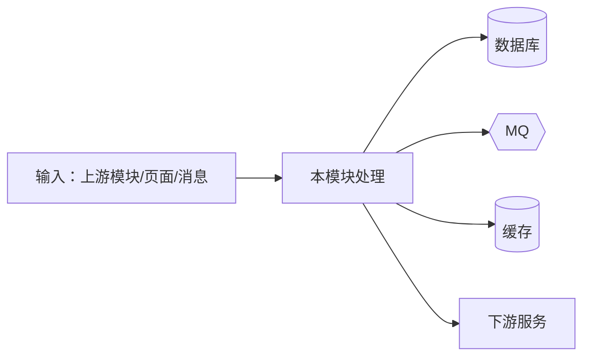
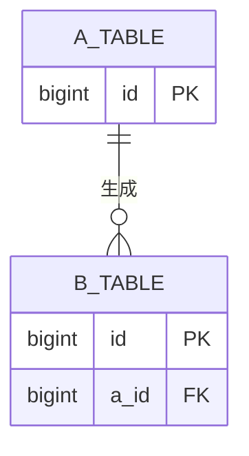
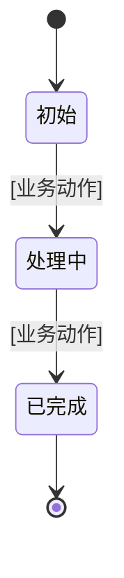
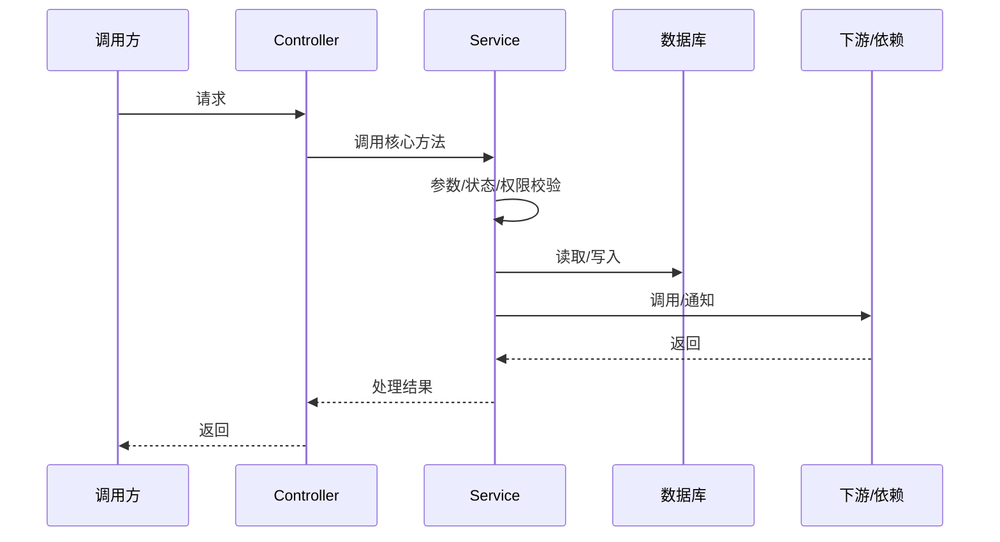

# 【模块名称】

## 1. 模块定位

### 1.1 职责与边界
- 一句话职责：[这个模块解决什么业务问题]
- 不做什么（边界）：[明确排除的职责，避免和其他模块混淆]

### 1.2 归属与上下游
- 所属系统/子系统：
- 上游：[上游模块/系统] — [给本模块什么：数据/消息/请求]
- 下游：[下游模块/系统] — [从本模块拿什么：数据/消息/接口]

### 1.3 核心价值
- [计算 / 存储 / 消息转发 / 权限 / 数据同步 / 对外 API 网关，一句话判断]

### 1.4 触发业务场景

| 场景名称 | 触发业务流程 | 场景类型 | 本模块动作 | 结果 |
|---|---|---|---|---|
| [场景名称] | [谁因为什么触发] | 正常 | [本模块做什么] | [结果] |
| [场景名称] | [异常来源] | 异常 | [本模块做什么] | [结果] |

---

## 2. 接口与数据流

> 本章最优先整理。先盘清对外暴露，再画数据流向，最后落核心数据模型和状态机；状态流转是重灾区，逐条核对真实业务动作和触发条件。

### 2.1 对外暴露

| 类型 | 名称/入口 | 调用方/触发方式 | 说明 |
|---|---|---|---|
| HTTP 接口 | POST /api/xxx | 前端页面 | |
| Dubbo | XxxService#method | 上游服务 | |
| MQ 消息 | topic: xxx | 生产者 | |
| 定时任务 | XxxJob | 每日 00:00 | |
| 数据库触发器 | | | |

核心入口逐个展开：

#### 【入口名称】
- 类型：HTTP / Dubbo / MQ / 定时任务 / 数据库触发器
- 入参：
- 出参：
- 错误码：
- 限流/超时/重试策略：
- 代码定位：Controller/Handler、Service、核心方法（文件+类+方法，能定位行号时补充）

### 2.2 数据流向

- 输入：
- 内部处理：
- 输出：

### 2.3 核心数据模型

主要表/对象：

| 表/对象 | 用途 | 关键字段 | 主键/外键 | 本模块操作 |
|---|---|---|---|---|
| [表名] | [用途] | [关键字段] | [主键/外键] | 新增/更新/查询/作废 |

数据库关系图（表框只保留表达关系所需的主键/外键或关联字段）：

状态机（每个业务对象单独一张，每条迁移对应真实业务动作和触发条件）：

状态说明：

| 状态 | 业务含义 | 进入动作 | 允许的主要操作 | 退出动作 |
|---|---|---|---|---|
| [状态] | [含义] | [动作] | [操作] | [动作] |

---

## 3. 内部架构与核心流程

### 3.1 整体结构
- 分层：controller / service / dao
- 核心类：
- 核心组件：

### 3.2 主流程

### 3.3 分支流程

| 分支/异常 | 触发条件 | 处理方式 | 结果 |
|---|---|---|---|
| 失败 | | | |
| 重试 | | | |
| 补偿 | | | |
| 降级 | | | |
| 兜底 | | | |

### 3.4 依赖

| 依赖 | 类型 | 用途 | 失败处理 |
|---|---|---|---|
| Redis | 中间件 | | |
| MySQL | 中间件 | | |
| RocketMQ | 中间件 | | |
| ES | 中间件 | | |
| [服务名.接口] | 服务接口 | | |

---

## 4. 参考文档

- PRD：
- 接口文档：
- 业务规则文档：
- 数据库/ERD：
- 相关思维笔记：
- 相关代码：
